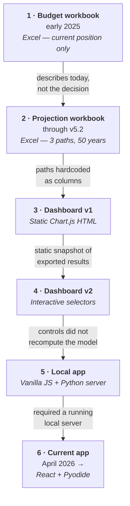

# Engineering Background

*From a spending spreadsheet to an in-browser projection engine.*

This document covers how the Career Plan financial planner was built: the five
implementations that preceded the current one, why each was replaced, and what
the rewrite proved wrong about the model it inherited.

For what the application does and how to run it, see [README.md](README.md).

**[Launch application](https://britt.gg/career-plan-app/)** ·
**[Source](https://github.com/jdtherobot/career-plan-app)**

---

## Why it exists

The project began in early 2025 as an ordinary budgeting spreadsheet. It became
an application because the decision it was meant to inform could not be
represented in a spreadsheet.

I am an active-duty Air Force service member. Entered service February 2014,
which puts me a little over twelve years in as of 2026, at a point where several
viable paths diverge:

- remain on active duty to a 20-year military retirement in 2034, then complete
  a PhD and enter research;
- separate in November 2027 and move directly into a computer science or
  technology role; or
- separate, take a gap year, complete a PhD earlier, and enter research sooner.

Each path changes the timing and value of salary, military retirement, VA
disability compensation, GI Bill entitlement, healthcare, taxes, retirement
contributions, and investment growth — and those effects compound for fifty
years. A generic retirement calculator cannot express "military pension *plus*
GI Bill housing allowance *plus* a PhD stipend for three of five years, then a
research salary, with Medicare replacing civilian premiums at 65."

The objective was never to predict one exact future. It was to build a model
detailed and transparent enough to show which assumptions drive the result, how
sensitive the comparison is to them, and where each path creates or sacrifices
value.

---

## The through-line

Six implementations. Each one solved a limitation in the last, and hit a new one
of its own.



| Phase | Implementation | Primary capability | Limitation that forced the next |
|---|---|---|---|
| **1. Budget workbook** | Excel: income, expenses, debt, assets, monthly cash flow | A structured view of the current financial position | Described the present state; could not evaluate a decision whose value depends on sequence and timing |
| **2. Projection workbook** | Excel: assumptions layer, career and school reference tables, 50-year projections, charts, three paths | Connected editable assumptions to long-range output, comparably across paths | Paths A/B/C were fixed sets of columns; any new ordering meant rebuilding formulas |
| **3. Dashboard v1** | Standalone Chart.js HTML generated from workbook output | Separated presentation from calculation; made results legible | A static snapshot — changing an assumption meant editing Excel and regenerating |
| **4. Dashboard v2** | Interactive HTML: horizon, path visibility, school/employer/VA selectors | Demonstrated the value of a purpose-built interface | The selectors displayed alternative reference values but did not recompute the model |
| **5. Local application** | Vanilla JS front end served by a local Python server on `127.0.0.1:8000` | First real composable path editor, backed by a live engine | Required a running local server — could not be shared or deployed as static files |
| **6. Current application** | React + TypeScript over a Python engine in Pyodide | Composable timelines, month-level computation, validation, persistence, testing, exports | Current implementation |

The workbook lineage ran through roughly a dozen internal revisions to v5.2. By
that point it held a structured assumptions layer, sourced reference tables,
path-specific projections, summary metrics, calculation notes, and cross-sheet
traceability. It was less a spreadsheet than the first complete specification
for the application that replaced it.

---

### Phase 1 — Budgeting and current position

The first workbook answered standard personal-finance questions: monthly income
after deductions, spending capacity, savings, net worth.


Useful for establishing a starting point, but structurally unable to represent a
decision in which order and timing matter. A present-state budget cannot show
the effect of delaying a research career to reach military retirement, consuming
GI Bill entitlement during a PhD, or drawing a pension alongside later
employment.

### Phase 2 — The workbook as a financial model

The workbook was rebuilt into a three-path, 50-year projection model. Inputs
moved into a dedicated assumptions layer, supported by separate career and
school reference tables.


The columns on the right are the important part: every assumption carries a
source note, a statement of which projection it feeds, and a link back to the
sheet that owns it. That structure — inputs separated from output, each value
traceable to its origin — survived every rewrite and is still how the
application is organized.

Reference data was researched and sourced rather than estimated.


The projection sheet computed annual income, tax-free income, taxes, healthcare,
living expenses, retirement savings, net cash flow, and portfolio value for each
path across fifty years.


It also carried a per-year breakdown showing how each figure was derived and
which assumption produced it.


This version established the design principles that still hold: assumptions are
editable rather than buried in formulas; source data is separated from projected
output; every projected value is traceable to its input or method; paths are
compared over the same horizon and starting position; and summary results stay
connected to the underlying annual detail.

It also exposed the limitation that ended the spreadsheet era. Path A, Path B,
and Path C existed because three groups of columns had been written for them.
Adding a path, reordering phases, shifting a separation date, or inserting a gap
required formula changes across a large fraction of the workbook. The model
could compare the scenarios it had been built for; it could not represent the
decision space around them.

### Phase 3 — Dashboard v1

The first dashboard extracted workbook results into a standalone dark-theme
report, comparing two paths over thirty years.


This was the first real separation of calculation from presentation, and it made
the comparison substantially easier to reason about than the projection
worksheet. But the data was embedded directly in the HTML. Changing an
assumption meant editing Excel and regenerating the file.

### Phase 4 — Dashboard v2

The second dashboard widened the comparison to three paths and fifty years, and
added selectable horizons, per-path visibility, and reference selectors for grad
schools, post-PhD employers, and VA disability ratings.


This made the interface more exploratory and clarified the underlying problem.
The selectors could display alternative reference values, but they could not
rebuild the projections behind them. The interface had become interactive while
the model stayed static — and that gap was the point at which extending the
spreadsheet-plus-generated-HTML approach stopped being worthwhile.

### Phase 5 — The local application

The next implementation moved the model behind a live engine, served by a local
Python process and driven by a vanilla-JS front end.


This is where composability actually arrived. The navigation — Path Editor,
Manual Finance, Projection Explorer, Reference Data, Sources, Gap Tracker —
maps recognizably onto the current application's screens, and paths became
objects that could be added, edited, saved, and loaded rather than columns that
had to be authored.

Two things ended it. The first is visible in the screenshot: path totals of
roughly $21M, which are not plausible results but artifacts of a model with no
retirement drawdown — see "What the rewrite corrected" below. The second is in
the address bar. The application required a running Python server on
`127.0.0.1:8000`, which meant it could not be shared with anyone, deployed as
static files, or opened on a machine that did not have the project checked out
and running.

That constraint is what motivated the current architecture. Moving Python into
the browser was not an aesthetic preference — it was the only way to keep the
engine in Python while making the result something that could actually be
handed to someone.

### Phase 6 — The current application

The engine moved into a deterministic Python module, and the front end was
rebuilt in React and TypeScript. Instead of three hardcoded paths, a scenario is
a service profile plus an ordered sequence of timeline blocks.


---

## Current architecture

### Client-side Python through Pyodide

The projection engine is packaged with the application and loaded into the
browser through Pyodide, which runs CPython on WebAssembly. Computation happens
inside a Blob web worker so that long projections do not block the interface.

This resolves the Phase 5 constraint while preserving what was worth keeping:

1. **The engine stays Python.** The same code runs in local development,
   automated tests, build and export tooling, and the browser.
2. **Financial data stays local.** Salary, savings, benefits, and disability
   figures are never transmitted to a server, because there is no server.
3. **Deployment stays static.** The production build is ordinary static files —
   no database, no runtime, no host that has to keep a process alive.
4. **Interface and engine stay separate.** React handles interaction and
   presentation; Python remains responsible for computation and validation.

### One compute interface

Every runtime calls the same `compute()` function in `planner_app/api.py`. It
accepts a JSON-compatible input structure and returns a JSON-compatible result.
The browser is not running a reduced or reimplemented version of the financial
logic.

Each result carries a deterministic SHA-256 `inputHash` derived from
canonicalized inputs, so the live dashboard and every exported artifact can be
tied to the exact input set that produced them. This is what prevents a stale
export from being mistaken for a current one.

### Composable timelines

The largest structural change from the workbook is that a path is now data
rather than code. A scenario is a service profile plus an ordered list of
blocks — `tech_career`, `research_career`, `grad_school`, `gap`, `retire` —
with an exit type of either `military_retirement` or `separation`. Start and end
months derive from block order and duration.

That makes these representable without touching the engine:

- What changes if separation happens a year later?
- What if graduate school follows a two-year technical role?
- What if the PhD takes six years instead of five?
- What if a research career is replaced by a conventional technical one?
- What if retirement comes before graduate school rather than after?

Validation is part of the model rather than a layer on top of it. A scenario
claiming military retirement without sufficient service, exceeding available GI
Bill entitlement, or describing an impossible timeline is rejected with an
error rather than silently projected — which the spreadsheet would happily have
done.

---

## Financial model

The model computes at month-level resolution and aggregates upward, because
several major inputs do not begin or end on calendar-year boundaries. It
includes:

- military base pay and tax-free allowances;
- High-3 retirement derived from the projected final 36 months of base pay
  (average × 2.5% × completed years, per DFAS) rather than a fixed figure;
- VA disability compensation with COLA compounded uniformly from the
  service-exit year;
- a 36-month GI Bill entitlement ledger consumed by eligible school months
  wherever they fall in a timeline;
- graduate stipends and school-specific housing assumptions;
- technical-career and research-career compensation;
- employer retirement contributions;
- federal and simplified state tax estimates;
- military, retiree, student, civilian, and Medicare healthcare phases;
- researched location-based cost of living;
- cash, brokerage (with cost basis), Roth IRA, Roth TSP, and traditional 401(k)
  balances tracked individually;
- accumulation and retirement drawdown;
- Social Security claim-age adjustments and simplified provisional-income
  taxation;
- required minimum distributions; and
- nominal and real-dollar reporting.

Accounts are modeled separately rather than as a single blended balance. Cash is
held at a reserve floor and does not earn the assumed equity return.
Contributions, withdrawals, taxation, and drawdown therefore affect the account
they actually apply to.

At the configured drawdown age (default 59½), available income is applied first,
followed by withdrawals in a defined order: cash above the reserve floor,
brokerage, traditional accounts, then Roth. Medicare replaces the civilian
insurance track at 65, and required minimum distributions begin at 73.

---

## Application structure

Seven screens, separating three activities the spreadsheet mixed together —
entering assumptions, defining a scenario, and reviewing results:

- **Dashboard** — comparison and the major differences among paths
- **Path Builder** — timeline construction and validation
- **Finances** — current accounts, net worth, monthly cash flow
- **Explorer** — annual and phase-level detail for one path
- **Assumptions** — editable model inputs and overrides
- **Sources** — the reference catalog and supporting links
- **Export** — portable reports and workbooks

---

## Exports

Three formats, each stamped with the same input hash as the live result.

**Standalone interactive application.** The whole application — interface,
styles, current profile, precomputed results, and packaged engine — injected
into a single HTML file of roughly 1.3 MB. It opens offline and can still
recompute when edited.

**Advisor workbook.** An Excel export structured for review rather than
calculation: cover and comparison sheets, current position, a roughly 36-column
annual cash-flow sheet per path, milestones, assumptions and overrides, native
charts, and a hyperlinked source catalog. This keeps Excel as an audit and
communication format without making spreadsheet formulas authoritative again.

**Static HTML report.** The dashboard and explorer rendered to one static page
using the application's real React components via `react-dom/server`, with the
stylesheet inlined.

---

## What the rewrite corrected

The most useful thing the rewrite did was demonstrate that the legacy model's
numbers were wrong, and document exactly how.

Before changing any behavior, the legacy engine's output was captured as
golden-master fixtures and frozen. That gave a fixed reference for answering two
different questions separately: did a refactor preserve behavior that was meant
to stay the same, and did a documented correction change behavior in the
intended way? Every intentional change is recorded in
[docs/v2_delta_report.md](docs/v2_delta_report.md).

The legacy model produced final portfolios of roughly $15–20M and a lifetime
healthcare figure of $14,563. Neither was a result; both were artifacts.

| Defect | Effect |
|---|---|
| No retirement drawdown — portfolios only ever grew | Accounts never paid out; balances compounded to age 86 untouched |
| Civilian healthcare compounded at 8%/yr to 86 with no Medicare | ~$130K/yr by 2076, distorting the entire healthcare comparison |
| Cash earned the 7% equity return | Overstated growth on funds that were never invested |
| Pension hardcoded to one path | Not derived from service history, so it could not generalize |
| Accounts were a cosmetic split of one blended balance | Contributions, taxes, and withdrawals could not apply correctly |
| Employer 401(k) match ignored entirely | Omitted $0.69–0.97M of contributions per civilian-heavy path |

Correcting these reduced the apparent advantage of the path I expected to win.
Introducing Medicare at 65 cut Path B's modeled lifetime healthcare from
**$1,591,028 to $364,428**, and Path C's from **$991,749 to $256,644** —
collapsing most of the healthcare edge that staying to retirement appeared to
hold.

A later round of researched cost-of-living data — 15 locations across 9
categories, with at least two sources per rent figure — replaced the implicit
assumption that I would live at on-base prices indefinitely. That single
correction moved real-dollar horizon figures down by **$0.78M on Path B**
($5.17M → $4.39M) and **$1.26M on Path C** ($6.10M → $4.84M).

Those corrections were useful precisely because they made the comparison less
favorable to my prior. The purpose of the model is not to produce a preferred
answer; it is to show when that answer depends on an assumption that does not
hold.

---

## Testing

129 automated tests, all Python `unittest`:

```bash
python3 -m unittest discover -s tests
```

They cover legacy golden-master fixtures, the composable timeline schema and its
migrations, the XLSX exporters, location cost data, the service profile, the
single-file export template, and financial invariants:

- no negative account balances anywhere;
- an exact cash-flow identity on accumulation years;
- GI Bill consumption never exceeding 36 months;
- benefits never beginning before eligibility; and
- deterministic results for identical inputs.

**On native-to-Pyodide parity.** The build emits a `parity_fixture.json`
capturing native `compute()` output, and `tests/test_api.py` asserts the native
side of that contract. The browser-side assertion — loading the fixture under
Pyodide and comparing results — is **not currently wired up**. Parity is a
property of the architecture, since both runtimes execute the same Python
module, but at present it is not enforced by a test. Treating it as verified
would overstate what the suite actually checks.

---

## Stack

| Area | Implementation |
|---|---|
| Engine | Python — month-resolution timeline and lifecycle model, JSON `compute()` interface, advisor-grade XLSX exporter, versioned reference catalogs with sources |
| Browser execution | Pyodide / WebAssembly in a Blob web worker |
| Interface | React, TypeScript, Vite — seven screens, no runtime UI component library |
| Persistence | Browser-local IndexedDB for the planner payload, `localStorage` for interface preferences, JSON backup and restore |
| Testing | Golden-master fixtures, schema and migration tests, exporter tests, financial invariant tests |
| Export | Single-file interactive HTML, static HTML report, advisor XLSX workbook |
| Design | The Cybernetic Premium system shared with the rest of britt.gg — bone/cream and carbon with material gold, Rajdhani / Space Grotesk / JetBrains Mono, day-canonical with a persisted day/night toggle |
| Deployment | Static build published to GitHub Pages via GitHub Actions |

---

## Limitations

This is a planning model — not a tax engine, an investment guarantee, or a
substitute for professional financial advice.

Federal and state taxes are simplified through effective-rate and rule-based
estimates rather than return preparation. Market returns, compensation growth,
inflation, healthcare costs, and location data are assumptions, and the
reference data is a 2026 research snapshot that will need periodic updating.

The model is built to support comparative reasoning rather than to produce one
authoritative number. Its most useful outputs are the differences among paths,
the timing of those differences, and the assumptions responsible for them.

---

## Artifacts

Development artifacts are preserved under
[`docs/artifacts/`](docs/artifacts):

- `workbooks/spending-plan-workbook-template.xlsx` — the Phase 1 structure, unpopulated
- `workbooks/` — the Phase 2 projection workbooks, with personal balances replaced by illustrative values
- `dashboards/dashboard-v1.html` and `dashboard-v2.html` — the Phase 3 and 4 dashboards, which still open and run
- `screenshots/` — the workbook sheets, all three dashboards, the local application, and the current interface

The screenshots were captured in July 2026 from the preserved artifacts; they
are not period captures from the dates the artifacts were built.

---

*Author: JD Britt. Documentation and artifacts are licensed
[CC BY-NC 4.0](LICENSE-DOCS); the engine and application code are
[MIT](LICENSE).*
