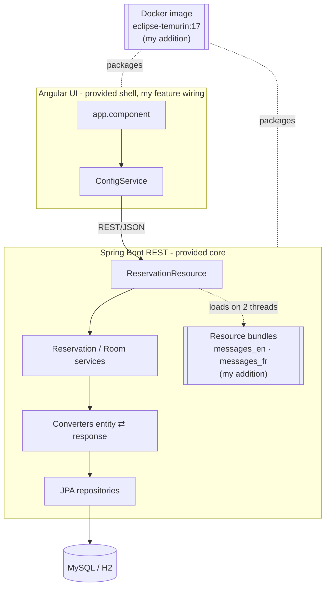

# Hotel Reservation Platform — i18n · Multithreading · Docker

**Repository:** `wgu-hotel-reservation-i18n-docker` *(private — access on request)* .\
**Stack:** Java 17 · Spring Boot · Spring Data JPA · Bean Validation · Jackson (JSR-310) · Angular · Docker (eclipse-temurin) · AWS (deployment design)

A full-stack hotel reservation application (the "Landon Hotel") that I extended with
internationalization, multithreaded resource loading, timezone/currency handling, and a
containerized single-image build. This is the most systems-oriented project of the set — the work
is in the concurrency, i18n, and reproducible delivery layered on top of an existing REST app.

> **My role:** The base full-stack app — the REST core (`ReservationResource`), JPA entities,
> converter layer, repositories, HATEOAS-style response models, and the Angular UI shell — was a
> **provided starter**. My contributions are the i18n + multithreading, the timezone and
> multi-currency features (backend logic *and* the Angular wiring to display them), the Dockerfile,
> and the cloud-deployment design. Those are the items under "What I built" below.

---

## Architecture

Layered Spring Boot REST service with a converter layer separating JPA entities from
request/response models, fronted by an Angular UI, packaged together into one Docker image. The
highlighted pieces (i18n bundles, multithreaded loading, Docker packaging) are my additions.

---

## What I built

- **Concurrency for i18n.** Added `GET /room/reservation/v1/welcome`, which loads English and
  French welcome messages from Java resource bundles **on two separate threads** and returns them as
  a list — a deliberate multithreaded design, surfaced live in the Angular UI.
- **Timezone conversion.** Wrote a Java method using `ZonedDateTime`/`ZoneId` to convert a
  live-presentation time across **ET, MT, and UTC**, exposed via
  `GET /room/reservation/v1/presentation-time` and rendered on the frontend.
- **Internationalized pricing display.** Extended the reservation view to present prices in USD ($),
  CAD (C$), and EUR (€) on separate lines.
- **Full-stack feature wiring.** Added the Angular `ConfigService` calls, `app.component`
  initialization, module providers, and template bindings so the backend's i18n/timezone data
  renders in the UI.
- **Reproducible, single-image delivery.** Authored a `Dockerfile` on `eclipse-temurin:17` that
  packages the Angular frontend and Spring Boot backend into one container image; verified by
  building `d387-advancedjava-landonhotelapp` and running it with `8080:8080` port mapping.
- **Cloud deployment design.** Documented an AWS path — push the image to a registry (Docker Hub),
  deploy the container to AWS Elastic Beanstalk — emphasizing parity between the locally tested image
  and the deployed one.

## Provided starter (for context)

The base app supplied the REST controller, `Room`/`Reservation` entities, the converter layer
(`RoomEntityToReservableRoomResponseConverter`, `ReservationRequestToReservationEntityConverter`,
…), JPA repositories, HATEOAS-style `Links`/`Self` response models, and the Angular UI shell. I
worked within that structure to add the features above.

---

## Screenshots

**Landon Hotel — bilingual (EN/FR) welcome and ET/MT/UTC presentation times, served from my multithreaded endpoint** .\

**Room availability with my multi-currency pricing (USD / CAD / EUR)** .\

**The app running inside the Docker container I packaged** .\

---

*Documentation of my work on this project. Source available privately on request.*
