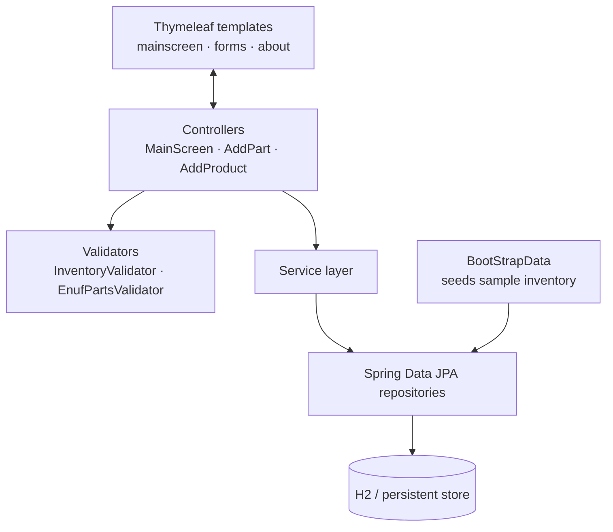

# Inventory Management System

**Repository:** `wgu-spring-boot-inventory-manager` *(private — access on request)*.\
**Stack:** Java 17 · Spring Boot · Spring MVC · Thymeleaf · Spring Data JPA · Bean Validation · JUnit

A server-rendered inventory application for a small retailer, modeling **parts** and **products**
with the business rule that products are assembled from associated parts. The app covers the full
CRUD lifecycle, enforces inventory bounds, and supports a lightweight purchase flow — all backed
by a validated domain model.

> **My role:** Starting from a provided Spring Boot parts/products starter, I added the min/max
> inventory invariants and validators, the "Buy Now" purchase flow, the sample-inventory seeding,
> unit tests, the UI/About-page customization, and a dead-code cleanup pass. Those additions are
> the "Engineering highlights" below.

---

## Architecture

Classic layered Spring MVC application. Controllers handle HTTP and form binding, the domain layer
carries the entities and validation logic, repositories abstract persistence, and Thymeleaf
renders server-side views.

**Packages:** `controllers` · `domain` · `service` · `repositories` · `validators` · `bootstrap`
(37 Java source files).

---

## Engineering highlights

- **Domain-level invariants.** Extended the `Part` entity with `minimum`/`maximum` inventory
  fields and enforced `min ≤ inventory ≤ max` through a custom `@ValidInventory` constraint and
  `InventoryValidator`. Invalid add/update attempts are rejected with targeted error messages.
- **Cross-entity validation.** `EnufPartsValidator` prevents a product update from driving any
  associated part's stock below its minimum — validating a rule that spans the product/part
  relationship, not just a single field.
- **Purchase flow.** A "Buy Now" action decrements *product* inventory (leaving component part
  inventory untouched) and reports success/failure inline to the user.
- **Persistence.** Entities are mapped to a relational store through Spring Data JPA repositories
  over an H2-backed database, keeping data access behind repository interfaces rather than raw SQL.
- **Idempotent seeding.** `BootStrapData` loads a sample catalog of five parts and five products
  only when the inventory is empty, so restarts don't duplicate data.
- **Testing.** Added `PartTest` JUnit unit tests covering the new min/max inventory fields and bounds.
- **Cleanup discipline.** Removed dead code including unused validators as part of a deliberate
  code-hygiene pass.
- **Front-end styling.** Hand-authored a custom stylesheet from scratch —
  a cohesive theme served from Spring Boot's static resources and linked
  into the Thymeleaf part/product form views, replacing the starter's unstyled defaults.

---

## Screenshots

**Main screen — "Noisette Café & Bakery" parts & products, with min/max inventory and Buy-Now**.\

**Cross-entity validation — a product update blocked because it would push a part below its minimum**.\

**Buy-Now — success, with inventory decremented**.\

**Buy-Now — failure when a product is out of stock**.\

---

*Documentation of my work on this project. Source available privately on request.*
