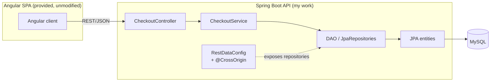

# Vacation Booking Platform

**Repository:** `wgu-spring-boot-vacation-booking-backend` *(private — access on request)* .\
**Stack:** Java 17 · Spring Boot · Spring Data JPA · Spring Data REST · MySQL · Lombok · Bean Validation · Angular 14 *(provided client)*

A full-stack e-commerce application for booking vacation packages and add-on excursions. A Spring
Boot REST backend models the domain and exposes it over HTTP; a course-provided Angular
single-page app consumes the API to drive browsing, cart, checkout, and order confirmation. The
app runs with the Angular dev server on `:4200` against the Spring Boot API.

> **My role:** I built the **entire Spring Boot backend** from the ground up — the JPA domain
> model, DAO/repository layer, services, REST controller, validation, bootstrap seeding, and REST
> configuration. The MySQL schema and the Angular client were **course-provided; I did not modify
> the frontend.** The engineering here is the backend: the domain mapping, the checkout service,
> and getting a clean REST contract that the *unmodified* Angular client consumes without error.

---

## Architecture

Two decoupled tiers over a normalized MySQL schema. My work is the backend, which follows a
controller → service → DAO layering over the JPA model; the provided Angular client consumes the
REST/JSON contract unchanged.

---

## Data model

The relational core models customers, their geography, and the cart/checkout lifecycle:

- **Country → Division → Customer** — a one-to-many geographic hierarchy resolving a customer to a
  region.
- **Customer → Cart → CartItem** — one-to-many ownership of carts and their line items.
- **CartItem ↔ Excursion** — a many-to-many relationship via an `excursion_cartitem` join table,
  so a booking line can carry multiple excursions.
- **Vacation** and **Excursion** — the sellable catalog.
- **StatusType** enum — persisted as lowercase values chosen deliberately for Angular
  compatibility and clean database mapping.

Backend packages: `controllers` · `services` · `dao` · `entities` · `config` · `bootstrap`
(24 Java files) — the full server tier, authored from the UML spec against the provided schema.

---

## Engineering highlights

- **Domain modeling from a UML spec.** Authored every JPA entity to match the required schema,
  mapping the relational core in Hibernate.
- **Deliberate relationship mapping.** Hand-mapped one-to-many and many-to-many associations
  (including the `excursion_cartitem` join table) rather than flattening the model.
- **Contract-driven enum design.** Chose the `StatusType` serialization format (lowercase values)
  to satisfy both the database mapping and the provided Angular consumer — an integration decision,
  not just a modeling one.
- **Layered persistence.** `CheckoutController` → `CheckoutService` → DAO/repositories over the JPA
  model, with `RestDataConfig` exposing the repository surface and `@CrossOrigin` enabling the
  Angular client to call the API across origins.
- **Checkout service.** Implemented `placeOrder` — generates a UUID **order-tracking number**,
  computes the cart **package price** from the selected vacation and excursions, associates cart
  items via a `Cart` helper method, and persists the completed order.
- **Validation & invariants.** Bean Validation on required checkout fields plus a guard that
  **rejects an empty-cart purchase**, so the REST contract fails loudly rather than persisting a
  bad order.
- **Auditing fields.** Added `create_date` / `last_update` population on customers, carts, and cart
  items (preserving the original creation date across updates) to satisfy the schema's audit columns.
- **REST contract.** The whole point of the assessment: the *unmodified* Angular
  client places a multi-excursion order with **no network error** and gets back a tracking number —
  verified in the browser Network tab and against the MySQL tables (see screenshots).

---

## Screenshots

*Captured with the provided Angular client (`localhost:4200`) driving my Spring Boot backend and
MySQL. The frontend is unmodified — these show my API and data layer working behind it.*

**Storefront — vacation package catalog served by the REST API, with live cart**

**Package drill-in — add-on excursions with running bag total**

**My REST endpoint at work — the `purchase` call returns `{"orderTrackingNumber": …}` with no network error**

**Purchase confirmation (tracking number generated by my checkout service)**

**Normalized schema verified in MySQL (`cart_items`, with the full relational model in the tree)**

**Many-to-many mapping proven — the `excursion_cartitem` join table populated after a multi-excursion order**

---

*Documentation of my backend implementation. Source available privately on request.*
