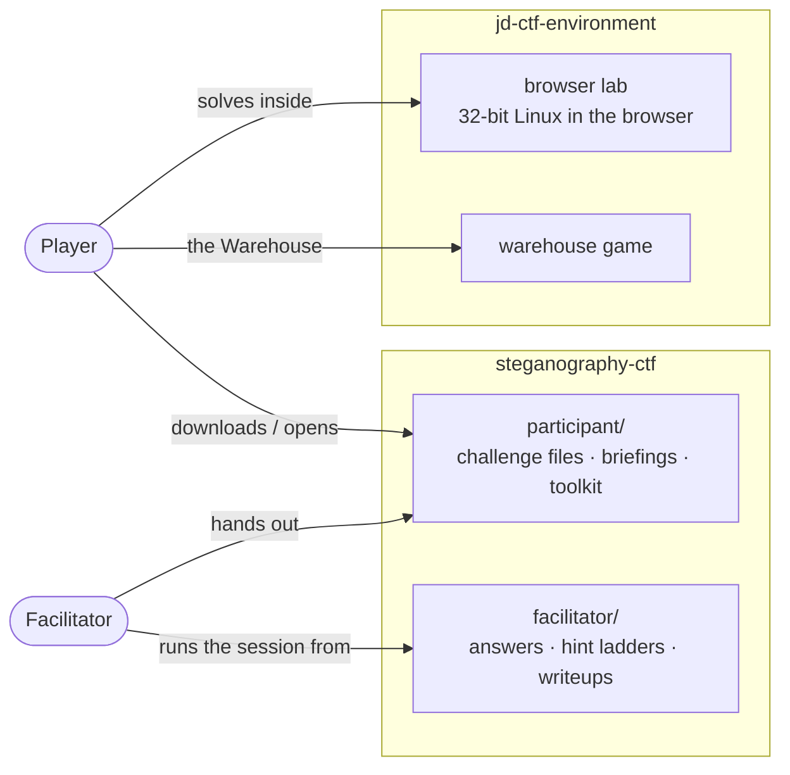
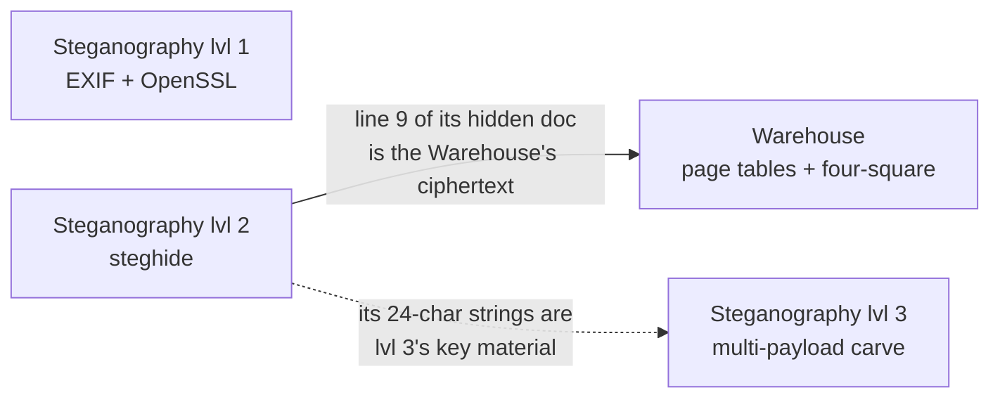

# Steganography CTF Challenges — Overview

A four-challenge capture-the-flag I authored around one running joke: a military signals unit that is
extremely good at hiding things and extremely bad at keeping secrets. Players pull ciphertext out of
photo metadata, crack a hidden message, walk a virtual address through a warehouse the way a CPU walks
page tables, and peel a single JPEG apart into five stacked payloads. Every flag looks like `Flag{…}`.

> These are **writeups** — they explain how each challenge works, including the solutions. If you'd
> rather play first, the challenge files live in
> [participant/](https://github.com/jdtherobot/steganography-ctf/tree/main/participant), and you can
> **Launch challenges** to run them in the browser.

Everything is author-created and author-owned, and runs entirely on supplied local files — no
third-party systems, live services, or real credentials involved.

---

## How it all fits together

The project spans two repositories: **[steganography-ctf](https://github.com/jdtherobot/steganography-ctf)**
is the challenges and their documentation; **[jd-ctf-environment](https://github.com/jdtherobot/jd-ctf-environment)**
is where you actually run them — an in-browser 32-bit Linux lab and the warehouse game.

The design is deliberately **two-sided**. A *facilitator* hands players the spoiler-free
`participant/` folder and drives the session from `facilitator/` — releasing hints in stages,
troubleshooting dead ends, and checking answers. Everything a player needs to *do* the challenges,
they can do with standard local tools or inside the browser lab.

---

## The four challenges

| Challenge | Techniques | The one-liner |
|---|---|---|
| **Warehouse** | x86-64 page tables · four-square cipher | Resolve a virtual address to a physical shelf, then decode the note you find. |
| **Steganography lvl 1** | EXIF metadata · OpenSSL AES | The flag is encrypted in a photo's metadata — and the password is in the email body. |
| **Steganography lvl 2** | steghide · wordlist cracking | A message is hidden in an image behind a crackable passphrase. |
| **Steganography lvl 3** | binwalk carving · JPEG quantization-table stego · nested AES | One JPEG, five stacked payloads, three layers of encryption, a hidden key. |

They're mostly independent, with one hard dependency and one wink:

**Do Steganography lvl 2 before the Warehouse** — the Warehouse's cipher input is literally line 9 of
the document you recover in lvl 2. Steganography lvl 3 is self-contained but quietly reuses those same
strings as key material, tying the set together.

---

## The two sides, in practice

**Player side** — four challenge folders, each with a spoiler-free `BRIEF.md` and the file(s) you
need, plus a `PLAYER_TOOLKIT.md` that checks you have `exiftool`, `openssl`, `binwalk`, `steghide`,
`python3`, and friends. Work on your own machine, or **Launch challenges** to open the browser lab,
which ships the same files and tools pre-installed.

**Facilitator side** — for each challenge: a full writeup, a **staged hint ladder** (nudges that
escalate from "have you looked at the metadata?" to the exact command), a deterministic `rebuild.sh`
that regenerates the distributable, and an automated `solve_test.sh` that solves from the player files
and asserts the exact flag — plus room/setup notes and troubleshooting for the classic failure modes.

---

## How it was built

These challenges were **reconstructed** from an original event's working archive — a messy pile of
finished files, intermediate builds, duplicate folders, and conflicting revisions — treated as
immutable evidence:

- **Inventory & canonicalize.** All ~280 archived files were hashed; byte-identical duplicates grouped;
  conflicting revisions compared by *solvability*, not by which looked newest. Each chosen file is
  traced to its archive path + SHA-256 in
  [ARCHIVE_PROVENANCE.md](https://github.com/jdtherobot/steganography-ctf/blob/main/facilitator/ARCHIVE_PROVENANCE.md).
- **Repair, don't fake.** Steganography lvl 3's original had three real authoring bugs (a
  key-order/filename mismatch, an uncrackable "weak" password, a stray byte gap that broke carving). A
  corrected version was rebuilt outside the archive and re-validated end to end.
- **Prove it.** Every challenge has an automated solver test; all four pass from the player files
  alone. A secret-scan gate guarantees no flag or creator-only key leaks into the player bundle, and an
  archive-fingerprint check guarantees the original evidence was never modified
  ([validation report](https://github.com/jdtherobot/steganography-ctf/blob/main/facilitator/VALIDATION_REPORT.md)).
- **Make it playable anywhere.** The environment repo hosts a client-side 32-bit Linux lab (v86) so a
  player solves everything in a browser tab — no install — plus the warehouse game. The toolchain was
  proven by solving lvl 2 and lvl 3 inside a real 32-bit container.

---

*Author-created steganography CTF. Full content:
[steganography-ctf](https://github.com/jdtherobot/steganography-ctf) ·
[jd-ctf-environment](https://github.com/jdtherobot/jd-ctf-environment).*
