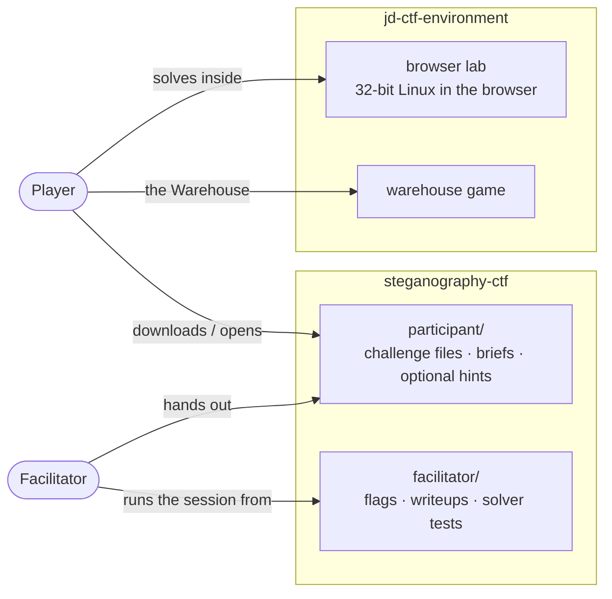
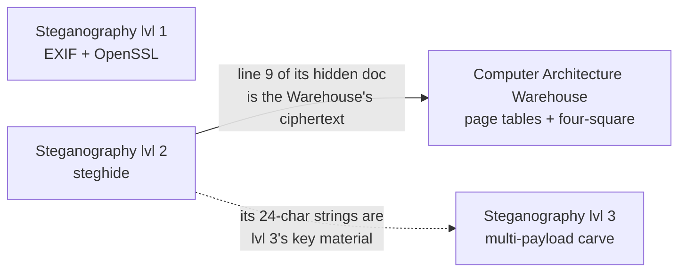

# Steganography CTF Challenges — Overview

Four challenges I built for a capture-the-flag. The first one was the seed: I wanted to hide a flag
in an image the easiest way I could think of, ended up putting it in the file's metadata, and the
rest of the set grew from there. Across the four you
pull ciphertext out of photo metadata, crack a hidden message, walk a virtual address through a
warehouse the way a CPU walks page tables, and take one JPEG apart into the files stacked behind it.
Every flag looks like `Flag{…}`.

> These are **writeups** — they explain how each challenge works, including the solutions. If you'd
> rather play first, the challenge files live in
> [participant/](https://github.com/jdtherobot/steganography-ctf/tree/main/participant), and you can
> **Launch challenges** to run them in the browser.

Everything here is created and owned by me, and each challenge is self-contained — it runs on its
own files, and nothing reaches out to a third-party system, a live service, or a real credential.

---

## How it all fits together

The project spans two repositories: **[steganography-ctf](https://github.com/jdtherobot/steganography-ctf)**
is the challenges and their documentation; **[jd-ctf-environment](https://github.com/jdtherobot/jd-ctf-environment)**
is where you actually run them — an in-browser 32-bit Linux lab and the warehouse game.

```mermaid
flowchart LR
  subgraph content["steganography-ctf"]
    direction TB
    P["participant/<br/>challenge files · briefs · optional hints"]
    F["facilitator/<br/>flags · writeups · solver tests"]
  end
  subgraph env["jd-ctf-environment"]
    direction TB
    LAB["browser lab<br/>32-bit Linux in the browser"]
    GAME["warehouse game"]
  end
  FAC(["Facilitator"]) -->|hands out| P
  FAC -->|runs the session from| F
  PLAYER(["Player"]) -->|downloads / opens| P
  PLAYER -->|solves inside| LAB
  PLAYER -->|the Warehouse| GAME
```

The design is deliberately **two-sided**. A *facilitator* hands players the spoiler-free
`participant/` folder and drives the session from `facilitator/` — releasing the optional hints in
order, troubleshooting dead ends, and checking answers. Everything a player needs to *do* the
challenges, they can do with standard local tools or inside the browser lab.

---

## The four challenges

| Challenge | Techniques | The one-liner |
|---|---|---|
| **Computer Architecture Warehouse** | x86-64 page tables · four-square cipher | Resolve a virtual address to a physical shelf, then decode the note you find. |
| **Steganography lvl 1** | EXIF metadata · OpenSSL AES | The flag is encrypted in a photo's metadata — and the password is in the email body. |
| **Steganography lvl 2** | steghide · wordlist cracking | A message is hidden in an image behind a crackable passphrase. |
| **Steganography lvl 3** | binwalk carving · JPEG quantization-table stego · nested AES | One JPEG, six stacked payloads, three layers of encryption, a hidden key. |

They're mostly independent, with one hard dependency and one wink:

```mermaid
flowchart LR
  L1["Steganography lvl 1<br/>EXIF + OpenSSL"]
  L2["Steganography lvl 2<br/>steghide"]
  WH["Computer Architecture Warehouse<br/>page tables + four-square"]
  L3["Steganography lvl 3<br/>multi-payload carve"]
  L2 -->|"line 9 of its hidden doc<br/>is the Warehouse's ciphertext"| WH
  L2 -.->|"its 24-char strings are<br/>lvl 3's key material"| L3
```

**Do Steganography lvl 2 before the Warehouse** — the Warehouse's cipher input is literally line 9 of
the document you recover in lvl 2. Steganography lvl 3 is self-contained but quietly reuses those same
strings as key material, tying the set together.

---

## The two sides, in practice

**Player side** — four
[challenge folders](https://github.com/jdtherobot/steganography-ctf/tree/main/participant/challenges),
each with a spoiler-free `BRIEF.md` and the file(s) you need. Steganography lvl 2 and the Warehouse
ship optional `hints/` to release in order; lvl 1 and lvl 3 have their hints woven into the
challenge itself (the email body; the brief's tall tale). Work on your own machine, or **Launch
challenges** to open the browser lab, which ships the same files and tools pre-installed.

**Facilitator side** — a
[GUIDE.md](https://github.com/jdtherobot/steganography-ctf/blob/main/facilitator/GUIDE.md) with
every flag, the run order, hint-release notes, and the Warehouse's in-person setup; a
facilitator-only
[TOOLKIT.md](https://github.com/jdtherobot/steganography-ctf/blob/main/facilitator/TOOLKIT.md) tool
checklist; and, for each challenge, a full
[writeup](https://github.com/jdtherobot/steganography-ctf/tree/main/facilitator/challenges) plus an
automated `solve_test.sh` that solves from the player files and asserts the exact flag.

---

## How it was built

The four challenges and the writeups here are my own work. The live event they debuted at — an
internal CTF in October 2025, hosted on CTFd — I co-designed and ran with a red-team-experienced
cybersecurity officer. Only my own challenges are published here: the challenges other contributors
built for that event, and the site we all built together to host it, aren't included.
Bringing the set here meant going back through the original files, refreshing
myself on how every piece fit together, and rewriting the documentation so it stands on its own on a
website instead of behind a CTFd instance.

The bigger lift was the environment. To host the whole thing on GitHub Pages — tight file-size
limits, no server — I built a client-side lab so the challenges run in a browser tab instead of
needing a real Linux box. I also wrote a solve script for each challenge that solves it end to end
from the player files, both to prove everything still works and so anyone running this in the future
has a reference solution on hand. And a secret-scan check runs over the player bundle to make sure no
flag or answer key ever ships in the files a participant downloads.

---

*My steganography CTF. Full content on GitHub:
[steganography-ctf](https://github.com/jdtherobot/steganography-ctf) ·
[jd-ctf-environment](https://github.com/jdtherobot/jd-ctf-environment).*
