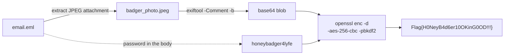

# Steganography lvl 1 — Photo Day

**Techniques:** EXIF metadata · OpenSSL AES · a password hiding in plain sight
**Flag:** `Flag{H0NeyB4d6er10OKinG0OD!!!}`

The gentle opener, and the one that sets the tone for the whole set: the puzzle isn't broken crypto,
it's a careless human.

---

## The theme

An intercepted email from "Secretary of Watermelon" to "Mr. Tema" at `military.signal`, gushing about
the squadron's shiny new **256-bit AES**. Attached: a badger photo. The gag is that they encrypted the
flag *properly*… then wrote the password directly into the email body — "Definitely not the
password: …".

---

## The mechanics

The flag was encrypted with OpenSSL and the ciphertext tucked into the JPEG's EXIF `Comment` field as
base64. So the solve is: parse the email, pull the attachment, read the EXIF comment, and decrypt with
the password that's sitting in the message the attachment came with.



```bash
exiftool -Comment -b attachment.jpeg > c.b64
openssl enc -aes-256-cbc -d -pbkdf2 -k honeybadger4lyfe -a -in c.b64
# → Flag{H0NeyB4d6er10OKinG0OD!!!}
```

---

## The lesson

Metadata is data. Running `exiftool` on anything interesting is free reconnaissance — and a "secure"
pipeline is only ever as strong as the human who narrates the password into the transcript.
