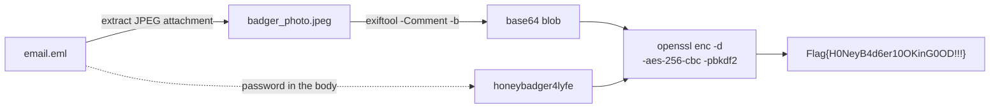

# Steganography lvl 1

The simplest challenge in the set, and the one the rest grew out of. It was my first pass at hiding a
flag in an image: the flag sits in the photo's metadata, and the password to decrypt it is written
right into the email the photo came attached to. If you know to check metadata, it's a quick one.

**File:** `email.eml`
**Flag:** `Flag{H0NeyB4d6er10OKinG0OD!!!}`
**Tools:** `exiftool`, `openssl`

## How it works

The email is an intercepted message from "Commander, 256 AES" to "Mr. Tema," with a photo attached.
The flag was encrypted with OpenSSL (AES-256-CBC), base64-encoded, and written into the JPEG's EXIF
`Comment` field. The password, `honeybadger4lyfe`, is in the body of the email, half-heartedly
disguised as "definitely not the password."

So the solve is: pull the attachment out of the email, read its EXIF comment, and decrypt that blob
with the password from the message.


```mermaid
flowchart LR
  A["email.eml"] -->|"extract JPEG attachment"| B["badger_photo.jpeg"]
  A -.->|"password in the body"| K["honeybadger4lyfe"]
  B -->|"exiftool -Comment -b"| C["base64 blob"]
  C --> D["openssl enc -d<br/>-aes-256-cbc -pbkdf2"]
  K --> D
  D --> E["Flag{H0NeyB4d6er10OKinG0OD!!!}"]
```

```bash
exiftool -Comment -b badger_photo.jpeg > c.b64
openssl enc -aes-256-cbc -d -pbkdf2 -k honeybadger4lyfe -a -in c.b64
# → Flag{H0NeyB4d6er10OKinG0OD!!!}
```

The one thing to take from it: metadata is data. Running `exiftool` on anything interesting is free
reconnaissance.
