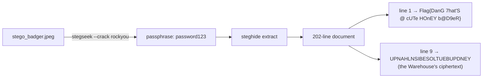

# Steganography lvl 2

**Techniques:** steghide · wordlist cracking · load-bearing "noise"
**Flag:** `Flag{DanG 7hat'S @ cUTe HOnEY b@D9eR}`

The set's first actual badger — a honey badger in a stegosaurus costume — carrying a genuinely
hidden file embedded by **steghide**. The passphrase is weak on purpose; the challenge is really
about *knowing* that images can carry password-protected payloads and reaching for a wordlist.

---

## The mechanics

`stegseek` (or `stegcracker`) rips through `rockyou` and finds the passphrase almost instantly;
`steghide extract` then pulls out a 202-line document. Line 1 is the flag. Lines 2–202 look like decoy
24-character strings — except they're not *all* decoys.



```bash
stegseek --crack stego_badger.jpeg rockyou.txt
steghide extract -sf stego_badger.jpeg -p password123
```

---

## The twist

**Line 9** of that document is the four-square ciphertext you'll need for the **Warehouse**, and the
whole 201-string block reappears as the key material behind **Steganography lvl 3**. What looks like
noise is load-bearing.

## The lesson

When a stego payload is *mostly* junk, ask what the junk is for. Here it's a field of red herrings
with two real needles hidden in it.
