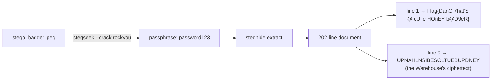

# Steganography lvl 2

A file is hidden inside the image with `steghide`, behind a passphrase. I set the passphrase to
something weak and guessable — `password123` — on purpose. The point of this one isn't cracking a
hard password; it's recognizing that an image can carry a password-protected payload, and getting
familiar with the tools that pull it back out (`steghide`, and a cracker like `stegseek` or
`stegcracker`).

**File:** `stego_badger.jpeg`
**Flag:** `Flag{DanG 7hat'S @ cUTe HOnEY b@D9eR}`
**Tools:** `steghide`, plus `stegseek` or `stegcracker` and a wordlist (`rockyou`)

## How it works

`stegseek` (or `stegcracker`) runs a wordlist like `rockyou` against the image and recovers the
passphrase in seconds — or you can just guess `password123`. `steghide extract` then pulls out a
202-line document. Line 1 is the flag; the rest looks like filler.


```mermaid
flowchart LR
  A["stego_badger.jpeg"] -->|"stegseek --crack rockyou"| P["passphrase: password123"]
  P --> X["steghide extract"]
  X --> D["202-line document"]
  D --> L1["line 1 → Flag{DanG 7hat'S @ cUTe HOnEY b@D9eR}"]
  D --> L9["line 9 → UPNAHLNSIBESOLTUEBUPDNEY<br/>(the Warehouse's ciphertext)"]
```

```bash
stegseek --crack stego_badger.jpeg rockyou.txt
steghide extract -sf stego_badger.jpeg -p password123
```

## Where it leads

The filler isn't all filler. **Line 9** of that document is the ciphertext the Computer Architecture
Warehouse needs, and the full block of 201 twenty-four-character strings comes back as the key
material behind Steganography lvl 3. Keep the document and you're already holding pieces of two other
challenges.
