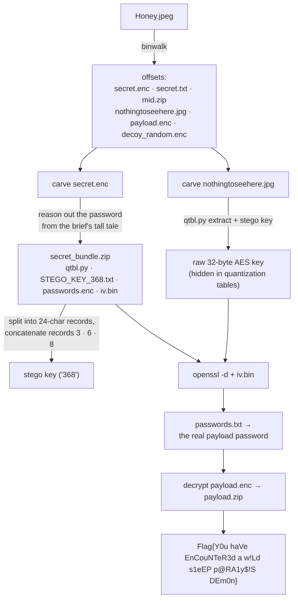

# Steganography lvl 3

**Techniques:** binwalk carving · a reasoned password · JPEG quantization-table stego · nested AES · filename-as-clue
**Flag:** `Flag{Y0u haVe EnCouNTeR3d a w!Ld s1eEP p@RA1y$!S DEm0n}`

The boss. One file — `Honey.jpeg` — that is secretly **a photo with six more payloads stacked
behind it**, wrapped in three layers of encryption, with a stego-hidden key and a couple of decoys
thrown in to waste your time.

---

## The mechanics

`binwalk` reveals the seams. You carve the pieces apart, **reason out** the weak outer layer's
password to recover a toolkit, use that toolkit to extract an AES key hidden in a JPEG's
**quantization tables**, and use *that* to unwind the inner layers down to the flag.

---

## The password you reason out

The weak outer layer is **not** a wordlist crack. The brief's tall tale — an old-timer spinning a
yarn about "John, back in the Desert Storm days" and his sharp pals *Aho, Weinberger, and
Kernighan* — is a recipe, not flavor text: it hands you a codename, tells you to add a `#`, then
"two numbers and a three-letter tag that danced between lower and upper case," and even scribbles
out the mask — `?d?d?l?u?l`. The AWK trio's trick of stitching "a word and a tail into one clean
rope" says to concatenate the pieces. Build the password, open `secret.enc`, and the toolkit bundle
is yours. (The literal string stays in the facilitator docs.)

## The clever bit

`STEGO_KEY_368.txt` *looks* like a wall of 4,824 characters. The `368` in the filename is the
instruction: split it into 24-character records and concatenate records **3, 6, 8** — in that order
— to build the XOR key that `qtbl.py` needs. (Those 24-char records? They're the same 201 strings
from **Steganography lvl 2** — the noise from earlier was the key all along.) The AES key itself
never appears in the bundle; it lives only in the low bits of the inner JPEG's quantization tables,
extractable only with the derived key.

## The decoys

`mid.zip` opens to a four-square red herring; `decoy_random.enc` is literally random bytes; a stray
`secret.txt` reads "better luck next time." Part of the challenge is *not* chasing them.

## The lesson

Real forensics is layered, and progress on one layer unlocks the tools for the next. It also rewards
reading filenames like clues — because here, one of them literally is.
