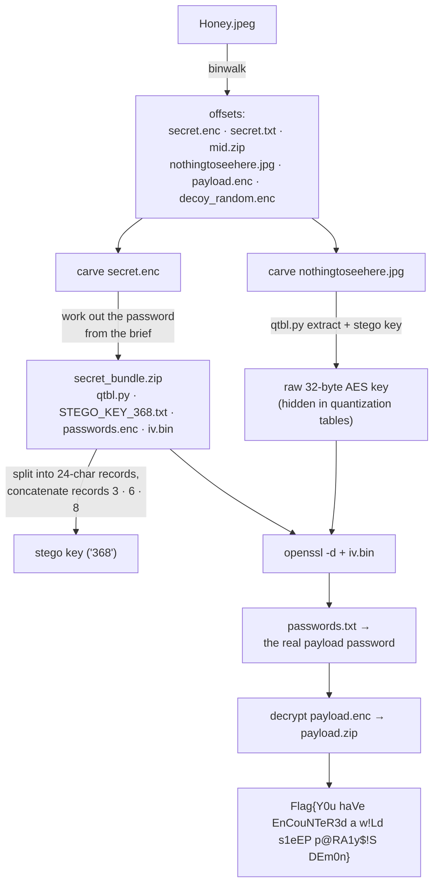

# Steganography lvl 3

The hardest challenge, and the one the whole set builds toward. It pulls every technique from the
earlier levels into a single file: carving, cracking, stego, and layered decryption. It also ties
back to lvl 2 and the Warehouse — the key material here is the same block of strings from lvl 2, and
one of those strings is the Warehouse's ciphertext — but everything you need ships inside this
challenge, so you can solve it start to finish on its own.

**File:** `Honey.jpeg` (277,078 bytes)
**Flag:** `Flag{Y0u haVe EnCouNTeR3d a w!Ld s1eEP p@RA1y$!S DEm0n}`
**Tools:** `binwalk`, `dd`, `openssl`, `unzip`, `xxd`, `python3`, `awk`

## How it works

The single JPEG is actually a photo with six more payloads concatenated behind it. `binwalk` shows
the seams. You carve the pieces apart, work out the password on the weak outer layer to unlock a
small toolkit, use that toolkit to pull an AES key hidden in a JPEG's quantization tables, and use
that key to unwind the inner layers down to the flag.

```mermaid
flowchart TD
  H["Honey.jpeg"] -->|binwalk| OFF["offsets:<br/>secret.enc · secret.txt · mid.zip<br/>nothingtoseehere.jpg · payload.enc · decoy_random.enc"]
  OFF --> SE["carve secret.enc"]
  SE -->|"work out the password<br/>from the brief"| BUN["secret_bundle.zip<br/>qtbl.py · STEGO_KEY_368.txt · passwords.enc · iv.bin"]
  BUN -->|"split into 24-char records,<br/>concatenate records 3 · 6 · 8"| KB["stego key ('368')"]
  OFF --> NJ["carve nothingtoseehere.jpg"]
  NJ -->|"qtbl.py extract + stego key"| AK["raw 32-byte AES key<br/>(hidden in quantization tables)"]
  AK --> DP["openssl -d + iv.bin"]
  BUN --> DP
  DP --> PW["passwords.txt →<br/>the real payload password"]
  PW --> PL["decrypt payload.enc → payload.zip"]
  PL --> FLAG["Flag{Y0u haVe EnCouNTeR3d a w!Ld s1eEP p@RA1y$!S DEm0n}"]
```

## The outer password

The weak outer layer isn't a wordlist crack — the password is spelled out in the challenge brief. The
brief tells a rambling story about "John, back in the Desert Storm days" and his friends Aho,
Weinberger, and Kernighan. That's the recipe: a codename, a `#`, two digits, and a three-letter
mixed-case tag — it even writes out the mask, `?d?d?l?u?l`. Aho / Weinberger / Kernighan is `awk`,
the nudge to concatenate the parts into one string. Build it that way and the outer layer opens. (The
literal password stays in the facilitator notes.)

## The key file

`STEGO_KEY_368.txt` looks like a wall of 4,824 characters. The `368` in the name is the instruction:
split it into 24-character records and concatenate records 3, 6, and 8, in that order, to build the
XOR key the extractor needs. Those records are the same 201 strings from lvl 2. The AES key itself is
never in the bundle — it lives in the low bits of the inner JPEG's quantization tables, and only the
derived key pulls it out.

## The decoys

A few pieces are there to burn your time: `mid.zip` opens to a four-square red herring,
`decoy_random.enc` is just random bytes, and a stray `secret.txt` reads "better luck next time."
Knowing what to ignore is part of the challenge.
