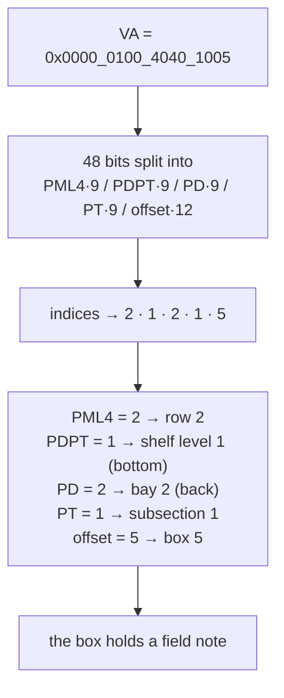
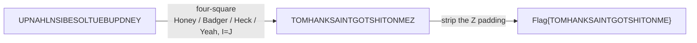

# Warehouse — a page-table walk you can walk through

**Techniques:** x86-64 virtual memory · page-table translation · four-square cipher
**Flag:** `Flag{TOMHANKSAINTGOTSHITONME}`

The centerpiece of the set, and the reason there's a warehouse game. You play a CPU's
memory-management unit: your TLB is empty, so you must **walk a page table** to resolve a virtual
address into a physical location — except "physical memory" is a warehouse, and the "physical address"
is a shelf you walk to and read a note off of.

---

## The walk

A 48-bit x86-64 virtual address splits into four 9-bit table indices and a 12-bit offset. The
warehouse is organized to match, one-to-one:



Convert the address to binary, chop it into `[9][9][9][9][12]`, and each field is a coordinate. No
lookups, no page-table base registers to chase — the address *is* the route. That is the whole trick:
the exercise looks like a scavenger hunt but is really "can you do a four-level page walk by hand?"

---

## The note

At **Row 2 · Shelf 1 · Bay 2 · Subsection 1 · Box 5**, you find a hand-drawn card:

```
   Honey            Badger
          dCode
         ▢ ▢ ▢ ▢
         Line #9
   Heck              Yeah
```

Four corner keywords, a nod to the **four-square cipher** (dCode is the tool), and a pointer back to
**line 9 of the Steganography lvl 2 document** — the 24-character string you carried out of the
steghide challenge.

---

## The cipher

The four-square is set up with all four 5×5 squares keyed — corner word to corner square exactly as
printed (`HONEY` / `BADGER` / `HECK` / `YEAH`), with I and J merged. Decoding line 9:



> **Reconstruction note.** The archive's Warehouse folder was empty — no flag file survived. The
> plaintext `TOMHANKSAINTGOTSHITONME` is verified ground truth: it's the *unique* four-square decode of
> the surviving ciphertext, confirmed by an exhaustive 2,401-configuration search over every
> corner/keyword arrangement. So `Flag{TOMHANKSAINTGOTSHITONME}` is a documented reconstructed default
> in the `Flag{…}` house style.

---

## The game

In the original run this was a real, physical warehouse. The
[warehouse game](https://github.com/jdtherobot/jd-ctf-environment) recreates it: a top-down space of
**10 rows × 3 shelf levels × 2 bays × 8 subsections × 7 boxes — 3,360 locations**. Every wrong box
says "Nothing here"; the one correct box hands you the field note. It's an immersion layer, not a lock
— the coordinates live in shipped JavaScript — so the *real* gate is understanding the page-table walk.

**The lesson.** Computer-architecture fluency, disguised as a scavenger hunt. If you've ever drawn a
four-level page-table walk on a whiteboard, you already knew where the box was.
