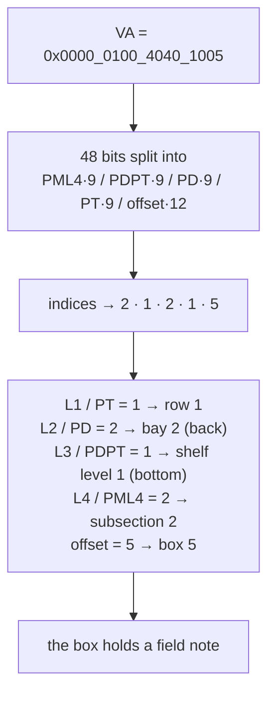
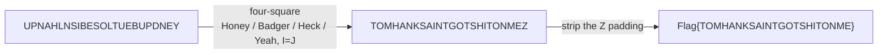

# Computer Architecture Warehouse

Probably the most fun challenge in the set, and the one that pulls in the widest mix of things — some
computer architecture, a little geography, and a cipher at the end. You're cast as the MMU: you're
handed a virtual address and no shortcuts, so you have to do a page-table walk by hand to turn it into
a physical location. If you already know what that means, it's quick. If you don't, you end up
learning how virtual memory and address translation actually work in order to solve it.

**Given:** the virtual address `0x0000_0100_4040_1005`
**Flag:** `Flag{TOMHANKSAINTGOTSHITONME}`
**Tools:** pen and paper, and a four-square cipher tool (e.g. dcode.fr)

## The walk

A 48-bit x86-64 virtual address splits into four 9-bit table indices and a 12-bit offset. The
warehouse is laid out to match, one-to-one:


```mermaid
flowchart TD
  VA["VA = 0x0000_0100_4040_1005"]
  VA --> SPLIT["48 bits split into<br/>PML4·9 / PDPT·9 / PD·9 / PT·9 / offset·12"]
  SPLIT --> IDX["indices → 2 · 1 · 2 · 1 · 5"]
  IDX --> MAP["L1 / PT = 1 → row 1<br/>L2 / PD = 2 → bay 2 (back)<br/>L3 / PDPT = 1 → shelf level 1 (bottom)<br/>L4 / PML4 = 2 → subsection 2<br/>offset = 5 → box 5"]
  MAP --> NOTE["the box holds a field note"]
```

Convert the address to binary, chop it into `[9][9][9][9][12]`, and name the fields the way x86
does — Level 4 (PML4) is the top 9 bits, down to Level 1 (PT) just above the offset. Each level
*number* is then a warehouse coordinate — L1 → row, L2 → bay (front/back), L3 → shelf level,
L4 → subsection, offset → box — so you walk the floor L1 → L4, big structure to small. No
page-table base registers to chase, the address *is* the route. It looks like a scavenger hunt but
it's really a four-level page walk done by hand.

---

## The note

At **Row 1 · Bay 2 (back) · Shelf 1 (bottom) · Subsection 2 · Box 5**, you find a hand-drawn card:

```
   Honey            Badger
          dCode
         ▢ ▢ ▢ ▢
         Line #9
   Heck              Yeah
```

Four corner keywords, a pointer to the four-square cipher (dCode is the tool), and "Line #9" — line 9
of the Steganography lvl 2 document, the 24-character string you carried out of the steghide
challenge.

---

## The cipher

The four-square is set up with all four 5×5 squares keyed — corner word to corner square exactly as
printed (`HONEY` / `BADGER` / `HECK` / `YEAH`), with I and J merged. Decoding line 9:


```mermaid
flowchart LR
  CT["UPNAHLNSIBESOLTUEBUPDNEY"] -->|"four-square<br/>Honey / Badger / Heck / Yeah, I=J"| PT["TOMHANKSAINTGOTSHITONMEZ"]
  PT -->|"strip the Z padding"| FLAG["Flag{TOMHANKSAINTGOTSHITONME}"]
```

---

## The warehouse

The original ran in a real, physical warehouse — I put up my own row labels and left the field note
in an actual box for people to walk to and find. The
[warehouse game](https://github.com/jdtherobot/jd-ctf-environment) recreates that: a top-down space
of **10 rows × 3 shelf levels × 2 bays × 8 subsections × 7 boxes — 3,360 locations**. Every wrong box
says "Nothing here"; the right one hands you the note. It's an immersion layer, not a lock — the
coordinates live in the shipped JavaScript — so the real gate is the page-table walk, not the search.
